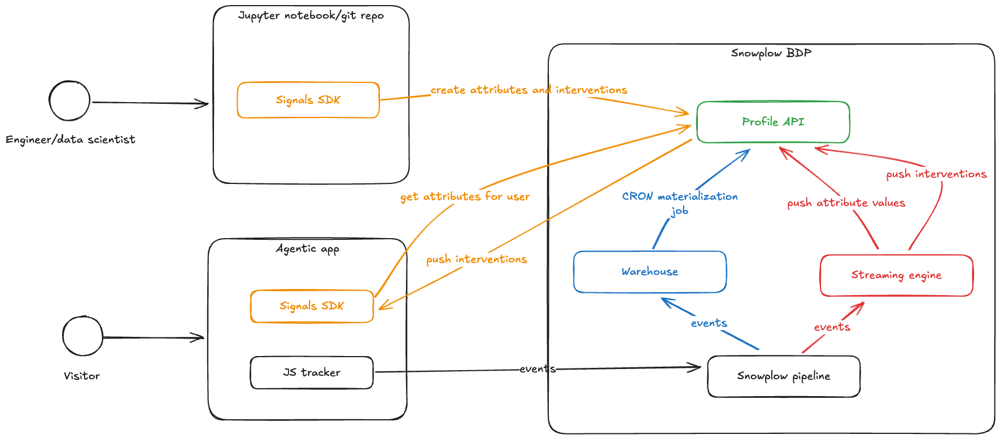

Snowplow Signals is a personalization engine built on Snowplow’s behavioral data pipeline. The Profile API, hosted in your BDP cloud allows you to create, manage and access user attributes by using the Signals SDKs.

Signals allows users to enhance their applications by aggregating user attributes and providing near real-time visibility into customer behavior. With seamless access to user history, it simplifies creating personalized, intelligent experiences.

### Sources

The `Source` of a view refers to the origin of the data. A source can be one of two types:

- **Batch Source:** Data that is aggregated and stored in a data warehouse, such as DBT models.
- **Stream Source:** Data that is aggregated in real-time in stream.

### Attributes

The foundation of Signals is the `Attribute`. An attribute represents a specific fact about a user's behavior. For example:

- **Number of page views in the last 7 days:** counts how many pages a user has viewed within the past week.
- **Last product viewed:** identifies the most recent product a user interacted with.
- **Previous purchases:** provides a record of the user's past transactions.

Signals calculates user attributes in two ways:

- Stream Processing: Real-time metrics for instant personalization.
- Batch Processing: Historical insights from data stored in your warehouse.

### Views

A `View` is a collection of attributes that share a common aggregator (eg `session_id` or `user_id`) and a data `Source`. You can picture it as a table of attributes, for example:

| user_id | number_of_pageviews | last_product_viewed |  previous_purchases |
|---------|---------------------|---------------------|---------------------|
| `abc123`| 5                   |     Red Shoes       |[`Blue Shoes`, `Red Hat`]|

### Services

A `Service` is a collection of `Views` that are grouped to make the retrieval of attributes simpler. 

